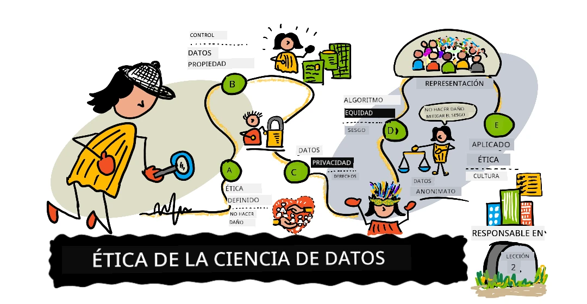

# Introducción a la ética de los datos

||
|:---:|
| Ética de la ciencia de datos: nota de boceto de [@nitya](https://twitter.com/nitya)_ |

---

We are all data citizens living in a datafied world.

Todos somos ciudadanos de datos que vivimos en un mundo con datos.

Las tendencias del mercado nos dicen que en el año 2022, 1 de cada 3 organizaciones grandes compro y vendio sus datos a través de [mercados e intercambios](https://www.gartner.com/smarterwithgartner/gartner-top-10-trends-in-data-and-analytics-for-2020/) en línea. Como **desarrolladores de aplicaciones**, nos resultará más fácil y económico integrar conocimientos basados ​​en datos y automatización basada en algoritmos en las experiencias diarias de los usuarios. Pero a medida que la IA se vuelve omnipresente, también necesitaremos comprender los daños potenciales causados ​​por la [utilización](https://www.youtube.com/watch?v=TQHs8SA1qpk) de tales algoritmos como armas a escala.

Las tendencias también indican que crearemos y consumiremos más de [180 zettabytes](https://www.statista.com/statistics/871513/worldwide-data-created/) de datos para 2025. Como **científicos de datos**,esto nos brinda niveles de acceso a datos personales sin precedentes. Esto significa que podemos crear perfiles de comportamiento de los usuarios e influir en la toma de decisiones de manera que creen una [ilusión de libre elección](https://www.datasciencecentral.com/profiles/blogs/the-illusion-of-choice) y al mismo tiempo, impulsen potencialmente a los usuarios hacia los resultados que preferimos. También plantea preguntas más amplias sobre la privacidad de los datos y la protección de los usuarios.

La ética de los datos es ahora una barrera necesaria para la ciencia y la ingeniería de datos, y nos ayuda a minimizar los daños potenciales y las consecuencias no deseadas de nuestras acciones basadas en datos. El [Gartner Hype Cycle for AI](https://www.gartner.com/smarterwithgartner/2-megatrends-dominate-the-gartner-hype-cycle-for-artificial-intelligence-2020/) dentifica tendencias relevantes en ética digital, IA responsable y gobernanza de la IA como impulsores clave de megatendencias más amplias en torno a la _democratización_ e _industrialización_ de la IA.

En esta lección, exploraremos el fascinante área de la ética de los datos, desde conceptos y desafíos centrales hasta estudios de casos y conceptos de IA aplicados como la gobernanza, que ayudan a establecer una cultura ética en equipos y organizaciones que trabajan con datos e IA.

## [Pre-lecture quiz](https://purple-hill-04aebfb03.1.azurestaticapps.net/quiz/2) 🎯

## Definiciones basicas

Comencemos por comprender la terminología básica.

La palabra “ética” proviene del [vocablo griego “ethikos”](https://en.wikipedia.org/wiki/Ethics) (y su raíz “ethos”) que significa carácter o naturaleza moral .

**La ética** se trata de los valores compartidos y los principios morales que gobiernan nuestro comportamiento en la sociedad. La ética no se basa en leyes sino en normas ampliamente aceptadas sobre lo que es "lo correcto y lo incorrecto". Sin embargo, las consideraciones éticas pueden influir en las iniciativas de gobierno corporativo y las regulaciones gubernamentales que crean más incentivos para el cumplimiento.

**La Ética de Datos** es una [nueva rama de la ética](https://royalsocietypublishing.org/doi/full/10.1098/rsta.2016.0360#sec-1) que "estudia y evalúa problemas morales relacionados con  _datos, algoritmos y prácticas correspondientes_". Aquí, **"los datos"**  se centran en acciones relacionadas con la generación, el registro, la conservación, el procesamiento, la difusión, el intercambio y el uso de los **"algoritmos"** se centran en la IA, los agentes, el aprendizaje automático y los robots, y las **"prácticas"**  se centran en temas como la innovación responsable. programación, hacking y códigos de ética.

**La Ética Aplicada** es la [aplicación práctica de consideraciones morales](https://en.wikipedia.org/wiki/Applied_ethics). Es el proceso de investigar activamente cuestiones éticas en el contexto de _acciones, productos y procesos del mundo real_,  y tomar medidas correctivas para que estos permanezcan alineados con nuestros valores éticos definidos.

**La cultura ética** consiste en [_poner en práctica la ética aplicada_](https://hbr.org/2019/05/how-to-design-an-ethical-organization) para garantizar que nuestros principios y prácticas éticos se adopten de manera consistente y escalable en toda la organización. Las culturas éticas exitosas definen principios éticos en toda la organización, brindan incentivos significativos para el cumplimiento y refuerzan las normas éticas al alentar y amplificar los comportamientos deseados en todos los niveles de la organización.

## Conceptos de ética

En esta sección, discutiremos conceptos como **valores compartidos** (principios) y **desafíos éticos** (problemas) para la ética de los datos, y exploraremos **estudios de casos**que lo ayudarán a comprender estos conceptos en contextos del mundo real.

### 1. Principios éticos

Cada estrategia de ética de datos comienza con la definición de _principios éticos_ - los "valores compartidos" que describen comportamientos aceptables y guían acciones de cumplimiento en nuestros proyectos de datos e inteligencia artificial. Puede definirlos a nivel individual o de equipo. Sin embargo, la mayoría de las organizaciones grandes los describen en una declaración o marco de misión ética de la IA que se define a nivel corporativo y se aplica de manera consistente en todos los equipos.

**Ejemplo:** la declaración de misión [Responsible AI](https://www.microsoft.com/en-us/ai/responsible-ai) de Microsoft dice: _"Estamos comprometidos con el avance de la IA impulsada por principios éticos que ponen a las personas en primer lugar"_ -  identificando seis principios éticos en el marco a continuación:

Exploremos brevemente estos principios. _La transparencia_ y _la rendición de cuentas_ on valores fundamentales sobre los que se basan otros principios, así que comencemos por ahí:

* [**La rendición de cuentas**](https://www.microsoft.com/en-us/ai/responsible-ai?activetab=pivot1:primaryr6) hace que los profesionales sean responsables de sus operaciones de datos e inteligencia artificial, y del cumplimiento de estos principios éticos.
* [**La transparencia**](https://www.microsoft.com/en-us/ai/responsible-ai?activetab=pivot1:primaryr6)  garantiza que los datos y las acciones de la IA sean comprensibles (interpretables) para los usuarios, explicando el qué y el por qué detrás de las decisiones.
* [**Equidad**](https://www.microsoft.com/en-us/ai/responsible-ai?activetab=pivot1%3aprimaryr6) - se centra en garantizar que la IA trate a todas las personas de manera justa, abordando cualquier sesgo sociotécnico sistémico o implícito en los datos y sistemas.
* [**Fiabilidad y seguridad**](https://www.microsoft.com/en-us/ai/responsible-ai?activetab=pivot1:primaryr6) - garantiza que la IA se comporte de forma coherente con los valores definidos, minimizando posibles daños o consecuencias no deseadas.
* [**Privacidad y seguridad**](https://www.microsoft.com/en-us/ai/responsible-ai?activetab=pivot1:primaryr6) - se trata de comprender el linaje de datos y brindar privacidad de datos y protecciones relacionadas a los usuarios.
* [**Inclusión**](https://www.microsoft.com/en-us/ai/responsible-ai?activetab=pivot1:primaryr6) - se trata de diseñar soluciones de IA con intención, adaptándolas para satisfacer una amplia gama de necesidades y capacidades humanas.

> 🚨 Piense en cuál podría ser su declaración de misión de ética de datos. Explore los marcos éticos de IA de otras organizaciones: aquí hay ejemplos de [IBM](https://www.ibm.com/cloud/learn/ai-ethics), [Google](https://ai.google/principles) y [Facebook](https://ai.facebook.com/blog/facebooks-five-pillars-of-responsible-ai/). ¿Qué valores compartidos tienen en común? ¿Cómo se relacionan estos principios con el producto o la industria de IA en la que operan?

### 2. Desafíos éticos

Una vez que hayamos definido los principios éticos, el siguiente paso es evaluar nuestros datos y acciones de IA para ver si se alinean con esos valores compartidos. Piense en sus acciones en dos categorías: recopilación de datos y diseño de algoritmos. 

Con la recopilación de datos, las acciones probablemente involucrarán **datos personales** o información de identificación personal (PII) de personas vivas identificables. Esto incluye [diversos elementos de datos no personales](https://ec.europa.eu/info/law/law-topic/data-protection/reform/what-personal-data_en) que identifican colectivamente a un individuo. Los desafíos éticos pueden estar relacionados con la privacidad de los datos , la propiedad de los datos y temas relacionados como el consentimiento informado y los derechos de propiedad intelectual de los usuarios.

Con el diseño de algoritmos, las acciones implicarán recopilar y seleccionar **conjuntos de datos**, uego usarlos para entrenar e implementar **modelos de datos** que predigan resultados o automaticen decisiones en contextos del mundo real. Los desafíos éticos pueden surgir del sesgo del conjunto de datos , problemas de calidad de los datos , injusticia y tergiversación en los algoritmos, incluidos algunos problemas que son de naturaleza sistémica.

En ambos casos, los desafíos éticos resaltan áreas donde nuestras acciones pueden entrar en conflicto con nuestros valores compartidos. Para detectar, mitigar, minimizar o eliminar estas preocupaciones, debemos hacer preguntas morales de "sí o no" relacionadas con nuestras acciones y luego tomar las acciones correctivas necesarias. Echemos un vistazo a algunos desafíos éticos y las cuestiones morales que plantean:

#### 2.1 Propiedad de los datos

La recopilación de datos a menudo implica datos personales que pueden identificar a los interesados. [La propiedad de los datos](https://permission.io/blog/data-ownership) se refiere al control y [_los derechos del usuario_](https://permission.io/blog/data-ownership) relacionados con la creación, el procesamiento y la difusión de datos.

Las preguntas morales que debemos plantearnos son: 
 * ¿A quién pertenecen los datos? (usuario u organización)
 * ¿Qué derechos tienen los interesados? (ej: acceso, borrado, portabilidad)
 * ¿Qué derechos tienen las organizaciones? (por ejemplo: rectificar reseñas de usuarios maliciosos)

#### 2.2 Consentimiento informado

[El consentimiento informado](https://legaldictionary.net/informed-consent/) define el acto por el cual los usuarios aceptan una acción (como la recopilación de datos) con una comprensión completa de los hechos relevantes, incluido el propósito, los riesgos potenciales y las alternativas.

Las preguntas para explorar aquí son:
 * ¿El usuario (titular de los datos) dio permiso para la captura y el uso de datos?
 * ¿El usuario entendió el propósito para el cual se capturaron esos datos?
 * ¿El usuario entendió los riesgos potenciales de su participación?

#### 2.3 Propiedad intelectual

[La propiedad intelectual](https://en.wikipedia.org/wiki/Intellectual_property) se refiere a creaciones intangibles resultantes de la iniciativa humana, que pueden tener valor económico para individuos o empresas.

Las preguntas para explorar aquí son:
 * ¿Los datos recopilados tenían valor económico para un usuario o empresa?
 * ¿El usuario tiene propiedad intelectual aquí?
 * ¿La **organización** tiene propiedad intelectual aquí?
 * Si estos derechos existen, ¿cómo los protegemos?

#### 2.4 Privacidad de datos

[La privacidad de los datos](https://www.northeastern.edu/graduate/blog/what-is-data-privacy/) o la privacidad de la información se refiere a la preservación de la privacidad del usuario y la protección de la identidad del usuario con respecto a la información de identificación personal.

Las preguntas para explorar aquí son:
 * ¿Están los datos (personales) de los usuarios protegidos contra ataques y filtraciones?
 * ¿Los datos de los usuarios son accesibles solo para usuarios y contextos autorizados?
 * ¿Se preserva el anonimato de los usuarios cuando se comparten o difunden datos?
 * ¿Se puede desidentificar a un usuario de conjuntos de datos anonimizados?

#### 2.5 Derecho al olvido
El [Derecho al Olvido](https://en.wikipedia.org/wiki/Right_to_be_forgotten) or [Derecho de Supresión](https://www.gdpreu.org/right-to-be-forgotten/)proporciona protección adicional de datos personales a los usuarios. Específicamente, otorga a los usuarios el derecho de solicitar la eliminación o eliminación de datos personales de búsquedas en Internet y otras ubicaciones, bajo circunstancias específicas , permitiéndoles un nuevo comienzo en línea sin que se les apliquen acciones pasadas.

Las preguntas para explorar aquí son:
 * ¿El sistema permite a los interesados ​​solicitar la supresión?
 * ¿La retirada del consentimiento del usuario debería provocar un borrado automático?
 * ¿Se recopilaron datos sin consentimiento o por medios ilegales?
 * ¿Cumplimos con las regulaciones gubernamentales sobre privacidad de datos?

#### 2.6 Sesgo del conjunto de datos

El sesgo de conjunto de datos o [recopilación](http://researcharticles.com/index.php/bias-in-data-collection-in-research/) consiste en seleccionar un subconjunto de datos no representativo para el desarrollo de algoritmos, creando una posible injusticia en los resultados para diversos grupos. Los tipos de sesgo incluyen sesgo de selección o muestreo, sesgo de voluntario y sesgo de instrumento.

Las preguntas para explorar aquí son:
 * ¿Contratamos a un conjunto representativo de interesados?
 * ¿Probamos nuestro conjunto de datos recopilados o seleccionados para detectar diversos sesgos?
 * ¿Podemos mitigar o eliminar cualquier sesgo descubierto?

#### 2.7 Calidad de los datos

[Data Quality](https://lakefs.io/data-quality-testing/) analiza la validez del conjunto de datos seleccionado utilizado para desarrollar nuestros algoritmos, verificando si las características y los registros cumplen con los requisitos del nivel de precisión y coherencia necesarios para nuestro propósito de IA.

Las preguntas para explorar aquí son:
 * ¿Captamos características válidas para nuestro caso de uso?
 * ¿Se capturaron datos de manera consistente en diversas fuentes de datos?
 * ¿Está completo el conjunto de datos para diversas condiciones o escenarios?
 * ¿Se captura la información con precisión para reflejar la realidad?

#### 2.8 Equidad del algoritmo

[La equidad del algoritmo ](https://towardsdatascience.com/what-is-algorithm-fairness-3182e161cf9f) verifica si el diseño del algoritmo discrimina sistemáticamente a subgrupos específicos de interesados, lo que genera [daños potenciales](https://docs.microsoft.com/en-us/azure/machine-learning/concept-fairness-ml) en la asignación (donde se niegan o retienen recursos de ese grupo) y la calidad del servicio (donde la IA no es tan precisa para algunos subgrupos como lo es). es para otros.

Las preguntas para explorar aquí son:
 * ¿Evaluamos la precisión del modelo para diversos subgrupos y condiciones?
 * ¿Examinamos el sistema en busca de daños potenciales (por ejemplo, estereotipos)?
 * ¿Podemos revisar los datos o volver a entrenar los modelos para mitigar los daños identificados?

Explore recursos como [las listas de verificación de equidad de IA](https://query.prod.cms.rt.microsoft.com/cms/api/am/binary/RE4t6dA) para obtener más información.

#### 2.9 Tergiversación

[La tergiversación de datos](https://www.sciencedirect.com/topics/computer-science/misrepresentation) consiste en preguntar si estamos comunicando conocimientos a partir de datos informados honestamente de manera engañosa para respaldar una narrativa deseada.

Las preguntas para explorar aquí son:
 * ¿Estamos reportando datos incompletos o inexactos?
 * ¿Estamos visualizando los datos de una manera que genera conclusiones engañosas?
 * ¿Estamos utilizando técnicas estadísticas selectivas para manipular los resultados?
 * ¿Existen explicaciones alternativas que puedan ofrecer una conclusión diferente?

#### 2.10 Libre Elección

La [ilusión de la libre elección](https://www.datasciencecentral.com/profiles/blogs/the-illusion-of-choice)  ocurre cuando las "arquitecturas de elección" del sistema utilizan algoritmos de toma de decisiones para empujar a las personas a tomar un resultado preferido mientras parecen darles opciones y control. Estos [patrones oscuros](https://www.darkpatterns.org/) pueden causar daños sociales y económicos a los usuarios. Debido a que las decisiones de los usuarios afectan los perfiles de comportamiento, estas acciones potencialmente impulsan decisiones futuras que pueden amplificar o extender el impacto de estos daños.

Las preguntas para explorar aquí son:
 * ¿Entendió el usuario las implicaciones de tomar esa decisión?
 * ¿El usuario conocía las opciones (alternativas) y los pros y los contras de cada una?
 * ¿Puede el usuario revertir una elección automatizada o influenciada más adelante?

### 3. Estudios de caso

To put these ethical challenges in real-world contexts, it helps to look at case studies that highlight the potential harms and consequences to individuals and society, when such ethics violations are overlooked. 

Here are a few examples:

| Ethics Challenge | Case Study  | 
|--- |--- |
| **Consentimiento informado** | 1972 - [Estudio de sífilis de Tuskegee](https://en.wikipedia.org/wiki/Tuskegee_Syphilis_Study) -  A los hombres afroamericanos que participaron en el estudio se les prometió atención médica gratuita, pero los investigadores los engañaron y no informaron a los sujetos sobre su diagnóstico ni sobre la disponibilidad del tratamiento. Muchos sujetos murieron y sus parejas o niños resultaron afectados; el estudio duró 40 años. | 
| **Privacidad de datos** |  2007 - El [premio de datos de Netflix](https://www.wired.com/2007/12/why-anonymous-data-sometimes-isnt/) proporcionó a los investigadores 10 millones de clasificaciones de películas anónimas de 50.000 clientes para ayudar a mejorar los algoritmos de recomendación. Sin embargo, los investigadores pudieron correlacionar datos anónimos con datos de identificación personal en conjuntos de datos externos (por ejemplo, comentarios de IMDb), "desanonimizando" efectivamente a algunos suscriptores de Netflix.|
| **Sesgo de colección**  | 2013 -  la ciudad de Boston [desarrolló Street Bump](https://www.boston.gov/transportation/street-bump), una aplicación que permitía a los ciudadanos informar sobre baches, brindando a la ciudad mejores datos sobre las carreteras para encontrar y solucionar problemas. Sin embargo, [las personas de los grupos de ingresos más bajos tenían menos acceso a automóviles y teléfonos](https://hbr.org/2013/04/the-hidden-biases-in-big-data), lo que hacía que sus problemas viales fueran invisibles en esta aplicación. Los desarrolladores trabajaron con académicos para abordar cuestiones de equidad en materia de acceso equitativo y brechas digitales. |
| **Equidad algorítmica**  | 2018 - El [estudio Gender Shades](http://gendershades.org/overview.html) del MIT evaluó la precisión de los productos de IA de clasificación de género, exponiendo brechas en la precisión para mujeres y personas de color. Una [Apple Card de 2019](https://www.wired.com/story/the-apple-card-didnt-see-genderand-thats-the-problem/) parecía ofrecer menos crédito a las mujeres que a los hombres. Ambos ilustraron problemas de sesgo algorítmico que conducen a daños socioeconómicos. |
| **Tergiversación de datos** | 2020 - El [Departamento de Salud Pública de Georgia publicó gráficos de COVID-19](https://www.vox.com/covid-19-coronavirus-us-response-trump/2020/5/18/21262265/georgia-covid-19-cases-declining-reopening) que parecían engañar a los ciudadanos sobre las tendencias en los casos confirmados con un orden no cronológico en el eje x. Esto ilustra la tergiversación mediante trucos de visualización. |
| **Ilusión de libre elección** | 2020 -  la aplicación de aprendizaje [ABCmouse pagó 10 millones de dólares para resolver una queja de la FTC](https://www.washingtonpost.com/business/2020/09/04/abcmouse-10-million-ftc-settlement/) en la que los padres se vieron atrapados en el pago de suscripciones que no podían cancelar. Esto ilustra patrones oscuros en las arquitecturas de elección, donde los usuarios fueron empujados hacia elecciones potencialmente dañinas. |
| **Privacidad de datos y derechos del usuario** | 2021 - [La filtración de datos](https://www.npr.org/2021/04/09/986005820/after-data-breach-exposes-530-million-facebook-says-it-will-not-notify-users) de Facebook expuso datos de 530 millones de usuarios, lo que resultó en un acuerdo de 5 mil millones de dólares para la FTC. Sin embargo, se negó a notificar a los usuarios sobre la infracción que violaba los derechos de los usuarios en materia de transparencia y acceso a los datos. |

Want to explore more case studies? Check out these resources:
* [Ethics Unwrapped](https://ethicsunwrapped.utexas.edu/case-studies) - dilemas éticos en diversas industrias.
* [Curso de ética de la ciencia de datos :](https://www.coursera.org/learn/data-science-ethics#syllabus) - exploración de estudios de casos emblemáticos.
* [Where things have gone wrong](https://deon.drivendata.org/examples/) - lista de verificación de Deon con ejemplos.

> 🚨 Piensa en los estudios de casos que has visto: ¿has experimentado o te has visto afectado por un desafío ético similar en tu vida? ¿Se le ocurre al menos otro estudio de caso que ilustre uno de los desafíos éticos que hemos discutido en esta sección?

## Ética Aplicada

Hemos hablado sobre conceptos, desafíos y estudios de casos de ética en contextos del mundo real. Pero, ¿cómo empezamos a aplicar principios y prácticas éticas en nuestros proyectos? ¿Y cómo ponemos en práctica estas prácticas para una mejor gobernanza? Exploremos algunas soluciones del mundo real:

### 1. Códigos Profesionales

Los códigos profesionales ofrecen una opción para que las organizaciones "incentiven" a sus miembros a apoyar sus principios éticos y su declaración de misión. Los códigos son pautas morales para el comportamiento profesional, que ayudan a los empleados o miembros a tomar decisiones que se alineen con los principios de su organización. Son tan buenos como el cumplimiento voluntario de los miembros; sin embargo, muchas organizaciones ofrecen recompensas y sanciones adicionales para motivar el cumplimiento por parte de los miembros.

Ejemplos incluyen:

 * Código de ética de [Oxford Munich](http://www.code-of-ethics.org/code-of-conduct/) .
 * Código de conducta [de la Asociación de ciencia de datos (creado en 2013)](http://datascienceassn.org/code-of-conduct.html). 
 * [Código de Ética y Conducta Profesional de ACM](https://www.acm.org/code-of-ethics) (desde 1993)

> 🚨 ¿Pertenece a una organización profesional de ingeniería o ciencia de datos? Explore su sitio para ver si definen un código de ética profesional. ¿Qué dice esto sobre sus principios éticos? ¿Cómo están "incentivando" a los miembros a seguir el código?

### 2. Ethics Checklists

Si bien los códigos profesionales definen el comportamiento ético requerido por parte de los profesional, [tienen limitaciones conocidas](https://resources.oreilly.com/examples/0636920203964/blob/master/of_oaths_and_checklists.md) en su aplicación, particularmente en proyectos a gran escala. En cambio, muchos expertos en ciencia de datos [abogan por listas de verificación](https://resources.oreilly.com/examples/0636920203964/blob/master/of_oaths_and_checklists.md), que pueden **conectar los principios con las prácticas** de maneras más deterministas y prácticas.

Las listas de verificación convierten las preguntas en tareas de "sí/no" que se pueden poner en práctica, lo que permite realizar un seguimiento de ellas como parte de los flujos de trabajo de lanzamiento de productos estándar.

Ejemplos incluyen:
 * [Deon](https://deon.drivendata.org/) - una lista de verificación de ética de datos de uso general creada a partir de [recomendaciones de la industria](https://deon.drivendata.org/#checklist-citations) con una herramienta de línea de comandos para una fácil integración.
 * [Lista de verificación de auditoría de privacidad](https://cyber.harvard.edu/ecommerce/privacyaudit.html) - proporciona orientación general para las prácticas de manejo de información desde perspectivas de exposición legal y social.
 * [Lista de verificación de equidad de IA](https://www.microsoft.com/en-us/research/project/ai-fairness-checklist/) - creada por profesionales de la IA para respaldar la adopción e integración de controles de equidad en los ciclos de desarrollo de la IA.
 * [22 preguntas sobre ética en datos e IA](https://medium.com/the-organization/22-questions-for-ethics-in-data-and-ai-efb68fd19429) - marco más abierto, estructurado para la exploración inicial de cuestiones éticas en contextos de diseño, implementación y organización.

### 3. Normas de Ética

La ética consiste en definir valores compartidos y hacer lo correcto de forma voluntaria. **El cumplimiento**  consiste en seguir la ley siempre y cuando esté definida. **La gobernanza** cubre ampliamente todas las formas en que las organizaciones operan para hacer cumplir los principios éticos y cumplir con las leyes establecidas.

Hoy en día, la gobernanza adopta dos formas dentro de las organizaciones. En primer lugar, se trata de definir principios **éticos de IA**  y establecer prácticas para operacionalizar la adopción en todos los proyectos relacionados con la IA en la organización. En segundo lugar, se trata de cumplir con todas **las normas de protección de datos** exigidas por el gobierno para las regiones en las que opera.

Ejemplos de normativa de protección de datos y privacidad:

 * `1974`, [Ley de Privacidad de EE. UU](https://www.justice.gov/opcl/privacy-act-1974) - regulates _federal govt._ collection, use ,and disclosure of personal information.
 * `1996`, [Ley de Responsabilidad y Portabilidad del Seguro Médico de EE. UU. (HIPAA)](https://www.cdc.gov/phlp/publications/topic/hipaa.html) -  protege los datos de salud personales.
 * `1998`, [Ley de protección de la privacidad infantil en línea de EE. UU. (COPPA)](https://www.ftc.gov/enforcement/rules/rulemaking-regulatory-reform-proceedings/childrens-online-privacy-protection-rule) - protege la privacidad de los datos de niños menores de 13 años.
 * `2018`, [Reglamento general de protección de datos (GDPR)](https://gdpr-info.eu/) - proporciona derechos de usuario, protección de datos y privacidad.
 * `2018`, [La Ley de Privacidad del Consumidor de California (CCPA)](https://www.oag.ca.gov/privacy/ccpa)  otorga a los consumidores más derechos sobre sus datos (personales).
 * `2021`, Acaba de aprobarse [la Ley de Protección de Información Personal](https://www.reuters.com/world/china/china-passes-new-personal-data-privacy-law-take-effect-nov-1-2021-08-20/) de China , que crea una de las regulaciones de privacidad de datos en línea más estrictas del mundo.

> 🚨  El RGPD (Reglamento General de Protección de Datos) definido por la Unión Europea sigue siendo una de las regulaciones de privacidad de datos más influyentes en la actualidad. ¿Sabías que también define [8 derechos de los usuarios ](https://www.freeprivacypolicy.com/blog/8-user-rights-gdpr) para proteger la privacidad digital y los datos personales de los ciudadanos? Aprenda qué son y por qué son importantes.

### 4. Cultura ética

Tenga en cuenta que sigue existiendo una brecha intangible entre el cumplimiento (hacer lo suficiente para cumplir "la letra de la ley") y abordar [cuestiones sistémicas](https://www.coursera.org/learn/data-science-ethics/home/week/4)  (como la osificación, la asimetría de la información y la injusticia distributiva) que pueden acelerar el uso de la IA como arma. 

Esto último requiere [collaborative approaches to defining ethics cultures](https://towardsdatascience.com/why-ai-ethics-requires-a-culture-driven-approach-26f451afa29f) que creen conexiones emocionales y valores compartidos consistentes entre las organizaciones de la industria. Esto exige [culturas de ética de datos más formalizadas](https://www.codeforamerica.org/news/formalizing-an-ethical-data-culture/) en las organizaciones, permitiendo a cualquiera tirar [del cordón de Andon](https://en.wikipedia.org/wiki/Andon_(manufacturing))  (para plantear inquietudes éticas en las primeras etapas del proceso) y hacer de las evaluaciones éticas (por ejemplo, en la contratación) un criterio central en la formación del equipo en proyectos de IA.

---
## [Post-lecture quiz](https://purple-hill-04aebfb03.1.azurestaticapps.net/quiz/3) 🎯

## Revisión y autoestudio

Los cursos y libros ayudan a comprender los conceptos y desafíos básicos de la ética, mientras que los estudios de casos y las herramientas ayudan con las prácticas éticas aplicadas en contextos del mundo real. Aquí hay algunos recursos para comenzar.

* [Machine Learning For Beginners](https://github.com/microsoft/ML-For-Beginners/blob/main/1-Introduction/3-fairness/README.md) - lección sobre equidad, de Microsoft.
* [Principios de IA responsable](https://docs.microsoft.com/en-us/learn/modules/responsible-ai-principles/) -  ruta de aprendizaje gratuita de Microsoft Learn.
* [Ética y ciencia de datos](https://resources.oreilly.com/examples/0636920203964) - Libro electrónico de O'Reilly (M. Loukides, H. Mason et. al)
* [Ética de la ciencia de datos](https://www.coursera.org/learn/data-science-ethics#syllabus) - curso en línea de la Universidad de Michigan.
* [Ethics Unwrapped](https://ethicsunwrapped.utexas.edu/case-studies) - estudios de casos de la Universidad de Texas.

# Tarea:

[Escriba un estudio de caso de ética de datos](Tarea.md).
