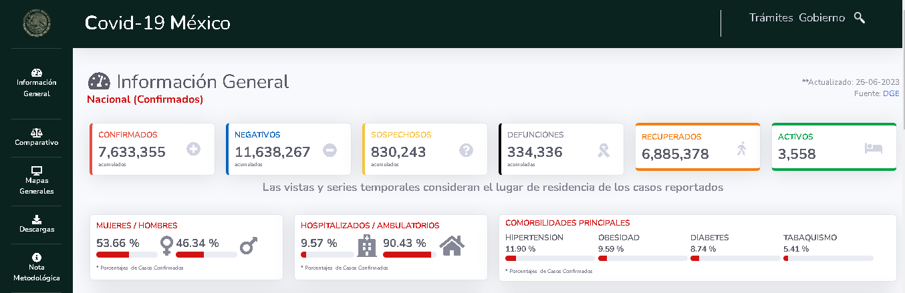
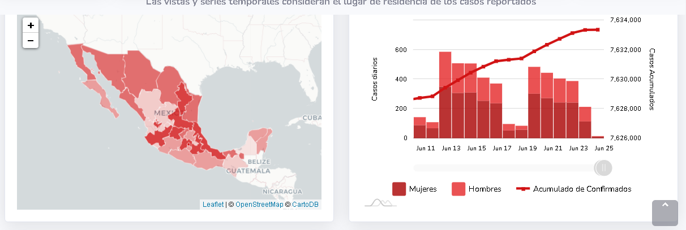

## Escriba un estudio de caso de ética de datos

## Instructions

Ha aprendido sobre varios [desafíos de la ética de los datos ](README.md#2-ethics-challenges) que ha visto algunos ejemplos de [estudios de casos](README.md#3-case-studies) que reflejan los desafíos de la ética de los datos en contextos del mundo real.

En esta tarea, escribirá su propio estudio de caso que refleje un desafío de ética de datos desde su propia experiencia o desde un contexto relevante del mundo real con el que esté familiarizado. Simplemente sigue estos pasos:

1. `Pick a Data Ethics Challenge`. Mire [los ejemplos de las lecciones](README.md#2-ethics-challenges) o explore ejemplos en línea como [ la Lista de verificación de Deon](https://deon.drivendata.org/examples/) para inspirarse.

2. `Describe a Real World Example`. Piense en una situación de la que haya oído hablar (titulares, estudios de investigación, etc.) o haya experimentado (comunidad local), donde se produjo este desafío específico. Piense en las cuestiones de ética de los datos relacionadas con el desafío y analice los posibles daños o consecuencias no deseadas que surgen debido a este problema. Puntos extra: piense en posibles soluciones o procesos que puedan aplicarse aquí para ayudar a eliminar o mitigar el impacto adverso de este desafío.

3. `Provide a Related Resources list`. Comparta uno o más recursos (enlaces a un artículo, una publicación o imagen de un blog personal, un trabajo de investigación en línea, etc.) para demostrar que esto ocurrió en el mundo real. Puntos de bonificación: comparta recursos que también muestren los posibles daños y consecuencias del incidente, o destaque las medidas positivas tomadas para evitar que se repita.

### Caso de Estudio: Desafíos Éticos en la Gestión de Datos durante la Pandemia de COVID-19 en México

<h4>Contexto:</h4>
La pandemia de COVID-19 presentó desafíos éticos significativos en todo el mundo, y México no fue la excepción. Durante la crisis sanitaria, las autoridades del gobierno mexicano enfrentaron dificultades en la gestión de datos relacionados con la propagación del virus, la atención médica y las medidas de control. Este estudio de caso se enfoca en los dilemas éticos que surgieron en el manejo de datos durante la pandemia en México.

Segun las cifras oficiales de las victimas por la pandemia en México acienden a mas 7 millones de casos y mas de 300,000 defunciones a causa de la enfermedad.

Datos obtenidos de un <a href="https://datos.covid-19.conacyt.mx/#DOView">informe</a> emitido por el CONAHCYT y el Gobierno de México.

Durante el periodo de gravedad de la pandemia surgieron muchas incertidumbres entre la población como la transparencia de los datos emitidos, su manipulación de estos, la saturación de hospitales junto con la falta de medicamentos e indumentaria para tratar y prevenir la crisis sanitaria en el país. Con esto surgieron los siguientes dilemas éticos de los datos.

<h4>Desafíos Éticos:</h4>

<strong>Transparencia y Comunicación de Datos:</strong> Desde el principio de la pandemia, se generaron inquietudes sobre la falta de transparencia en la comunicación de datos. Hubo críticas sobre la falta de información completa y precisa sobre la propagación del virus, las tasas de prueba y las cifras de mortalidad. Esto planteaba preguntas sobre la ética de la opacidad y la necesidad de información precisa para que el público tome decisiones informadas.

<strong>Manipulación Política de Datos:</strong> Surgieron acusaciones de manipulación política de datos relacionados con la pandemia. Se alega que las cifras de casos y muertes emitidas fueron subestimadas o maquilladas para minimizar el impacto de la crisis en la percepción pública y política. Este tipo de manipulación plantea cuestiones éticas graves en cuanto a la integridad de los datos y la toma de decisiones basadas en la evidencia.

<strong>Acceso Equitativo a la Atención Médica:</strong> Durante la pandemia, se enfrentó el desafío ético de garantizar el acceso equitativo a la atención médica y las vacunas. Ya que se debe abordar la cuestión de cómo se debían de asignar recursos limitados de manera justa y evitar la discriminación en la atención médica en función de factores como la ubicación geográfica o la condición socioeconómica de los habitantes del país.

<strong>Dilemas de Privacidad en el Rastreo de Contactos:</strong> Para controlar la propagación del virus, se implementaron programas de rastreo de contactos que involucraban la recopilación y el uso de datos personales. Esto planteaba preocupaciones éticas sobre la privacidad de los individuos y la necesidad de garantizar la seguridad de los datos mientras se lleva a cabo el rastreo.

<strong>Presión Política sobre Científicos y Expertos:</strong> Los científicos y expertos en salud pública a menudo se enfrentaron a presiones políticas para respaldar ciertas decisiones o comunicar información de cierta manera. Esto plantea dilemas éticos sobre la independencia de la investigación científica y la comunicación de la verdad a pesar de la presión política.

<a href="https://repositorio.lasalle.mx/bitstream/handle/lasalle/2074/LA%20CRISIS%20OCASIONADA%20POR%20LA%20COVID-19%20Y%20SUS%20EFECTOS%20EN%20EL%20EMPLEO%20Y%20LA%20POBREZA.pdf?sequence=1&isAllowed=y">En datos de 2020</a> se reporta, en el mes de abril, las pérdidas ya eran inmensas: se contaba con cerca de un millón y medio de personas confirmadas con el viruz SARS-CoV-2, así como un poco más de 87 mil defunciones y 317 mil recuperados en el mundo. Para mitad de mayo la situación empeoró, registrándose 4.63 millones de casos confirmados, de los cuales 1.68 millones de personas ya se habían recuperado y se habían experimentado 311 mil muertos. En términos comparativos entre abril y mayo de 2020, es decir, a lo largo de un mes, aumentaron 224 mil muertos, lo que significa que el número de muertos incrementó 3. 5 veces.

En México, las consecuencias de la crisis fueron considerables. Concretamente, el confinamiento empezó a finales del mes de marzo y en los meses siguientes se presenciaron los primeros números de la desafiante realidad. Ya que en mayo ya se contaba con 45,032 casos confirmados, 30,451 personas recuperadas y 4,767 muertes en nuestro país. 

<h4>Conclusión</h4>

En conclucion estos dilemas éticos en el manejo de datos durante la pandemia de COVID-19 en México requerian de una mayor transparencia en la comunicación de datos, la independencia de los científicos y expertos en salud pública, una gestión ética de los recursos de atención médica, medidas de privacidad robustas en el rastreo de contactos y la rendición de cuentas por parte de las autoridades. Además, es fundamental aprender de los errores del pasado y establecer políticas sólidas para futuras crisis de salud pública.

## Rúbrica

Ejemplar | Adecuado | Necesita mejorar
--- | --- | -- |
Se identifican uno o más desafíos de ética de datos.   El estudio de caso describe claramente un incidente del mundo real que refleja ese desafío y destaca las consecuencias indeseables o los daños que causó.   Hay al menos un recurso vinculado que demuestra que esto ocurrió. | Se identifica un desafío de ética de datos.    Se analiza brevemente al menos un daño o consecuencia relevante.    Sin embargo, la discusión es limitada o carece de pruebas de que haya ocurrido en el mundo real. | Se identifica un desafío de datos.    Sin embargo, la descripción o los recursos no reflejan adecuadamente el desafío ni prueban que ocurre en el mundo real. |

#### Esta es la evidencia que corresponde a la <a href="https://github.com/microsoft/Data-Science-For-Beginners/blob/main/1-Introduction/02-ethics/assignment.md">tarea</a> de la lección <a href="https://github.com/microsoft/Data-Science-For-Beginners/blob/main/1-Introduction/02-ethics/README.md">Introducción a la ética de los datos</a> del curso <a href="https://github.com/microsoft/Data-Science-For-Beginners/tree/main"> DATA SCIENCE FOR BEGINNERS</a> de Microsoft.