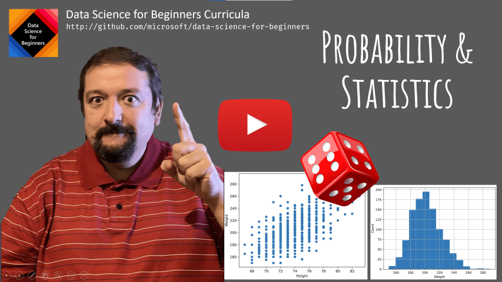
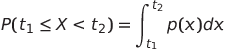
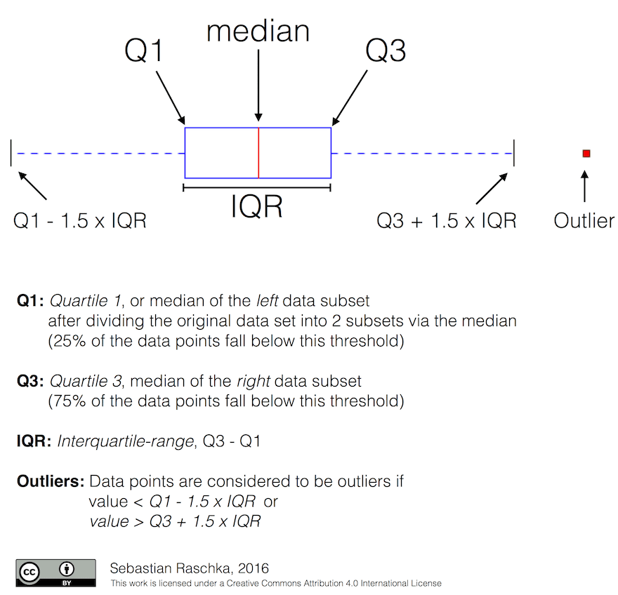
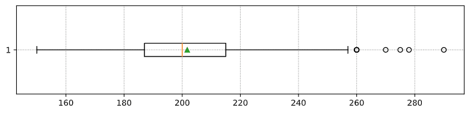
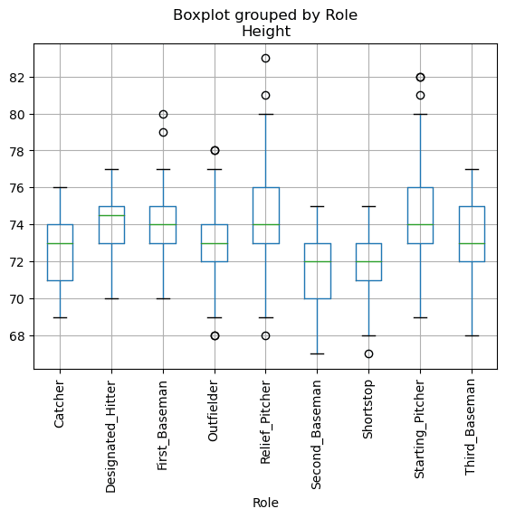
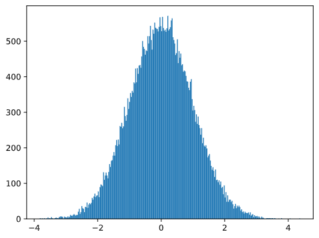
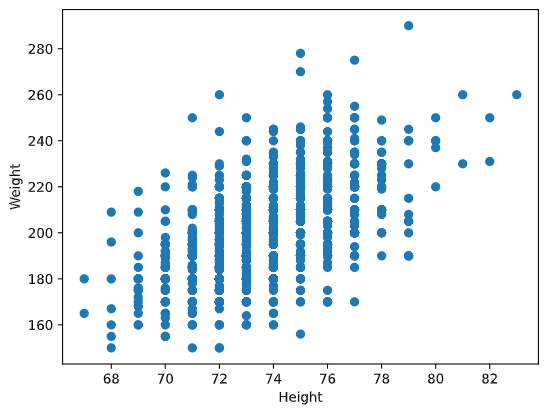

# Una breve introducción a la estadística y la probabilidad

| ](./img/image.png)|
|:---:|
| Estadística y probabilidad - _Sketchnote de [@nitya](https://twitter.com/nitya)_ |

La estadística y la teoría de la probabilidad son dos áreas de las matemáticas altamente relacionadas y muy relevantes para la ciencia de datos. Es posible operar con datos sin un conocimiento profundo de matemáticas, pero es mejor conocer al menos algunos conceptos básicos. Aquí presentaremos una breve introducción que le ayudará a empezar.

[](https://youtu.be/Z5Zy85g4Yjw)

## [Prueba previa a la conferencia](https://purple-hill-04aebfb03.1.azurestaticapps.net/quiz/6)

## Probabilidad y variables aleatorias
**La probabilidad** es un número entre 0 y 1 que expresa qué tan probable es un **evento** . Se define como una cantidad de resultados positivos (que conducen al evento), dividido por el número total de resultados, dado que todos los resultados son igualmente probables. Por ejemplo, cuando tiramos un dado, la probabilidad de que obtenga un número par es 3/6 = 0,5.

Cuando hablamos de eventos, utilizamos **variables aleatorias** . Por ejemplo, la variable aleatoria que representa un número obtenido al lanzar un dado tomaría valores del 1 al 6. El conjunto de números del 1 al 6 se llama **espacio muestral** . Podemos hablar de la probabilidad de que una variable aleatoria tome un determinado valor, por ejemplo P(X=3)=1/6.

La variable aleatoria del ejemplo anterior se llama **discreta** porque tiene un espacio muestral contable, es decir, hay valores separados que se pueden enumerar. Hay casos en los que el espacio muestral es un rango de números reales o el conjunto completo de números reales. Estas variables se denominan continuas . Un buen ejemplo es el momento en que llega el autobús.

## Distribución de probabilidad
En el caso de variables aleatorias discretas, es fácil describir la probabilidad de cada evento mediante una función P(X). Para cada valor s del espacio muestral S dará un número de 0 a 1, de modo que la suma de todos los valores de P(X=s) para todos los eventos sería 1.

La distribución discreta más conocida es **la distribución uniforme** , en la que existe un espacio muestral de N elementos, con igual probabilidad de 1/N para cada uno de ellos.

Es más difícil describir la distribución de probabilidad de una variable continua, con valores extraídos de algún intervalo [a,b], o del conjunto completo de números reales ℝ. Consideremos el caso de la hora de llegada del autobús. De hecho, para cada hora exacta de llegada t , la probabilidad de que un autobús llegue exactamente a esa hora es 0.

> Ahora sabes que los eventos con probabilidad 0 ocurren, ¡y muy a menudo! ¡Al menos cada vez que llega el autobús!

Solo podemos hablar de la probabilidad de que una variable caiga en un intervalo dado de valores, por ejemplo. P(t<sub>1</sub>&le;X&lt;t<sub>2</sub>). En este caso, la distribución de probabilidad se describe mediante una **función de densidad de probabilidad** p(x), tal que



Un análogo continuo de la distribución uniforme se llama **uniforme continuo**, que se define en un intervalo finito. La probabilidad de que el valor X caiga en un intervalo de longitud l es proporcional a l y aumenta hasta 1.

Otra distribución importante es **la distribución normal**, de la que hablaremos con más detalle a continuación.

## Media, varianza y desviación estándar

Supongamos que extraemos una secuencia de n muestras de una variable aleatoria X: x<sub>1</sub>, x<sub>2</sub>, ..., x<sub>n</sub>. Podemos definir el valor medio (o promedio aritmético ) de la secuencia de la manera tradicional como (x<sub>1</sub>+x<sub>2</sub>+x<sub>n</sub>)/n. A medida que aumentamos el tamaño de la muestra (es decir, tomamos el límite con n→∞), obtendremos la media (también llamada expectativa ) de la distribución. Denotaremos la expectativa por E (x).

> Se puede demostrar que para cualquier distribución discreta con valores {x<sub>1</sub>, x<sub>2</sub>, ..., x<sub>N</sub>} y probabilidades correspondientes  p<sub>1</sub>, p<sub>2</sub>, ..., p<sub>N</sub>, la expectativa sería igual a E(X)=x<sub>1</sub>p<sub>1</sub>+x<sub>2</sub>p<sub>2</sub>+...+x<sub>N</sub>p<sub>N</sub>.

Para identificar hasta qué punto se distribuyen los valores, podemos calcular la varianza &sigma;<sup>2</sup>  = &sum;(x<sub>i</sub> - &mu;)<sup>2</sup>/n, donde μ es la media de la secuencia. El valor σ se llama desviación estándar y &sigma;<sup>2</sup> se llama varianza.

## Moda, mediana y cuartiles

A veces, la media no representa adecuadamente el valor "típico" de los datos. Por ejemplo, cuando hay algunos valores extremos que están completamente fuera de rango, pueden afectar la media. Otra buena indicación es una mediana , un valor tal que la mitad de los puntos de datos son inferiores y la otra mitad superiores.

Para ayudarnos a comprender la distribución de los datos, resulta útil hablar de cuartiles :

- El primer cuartil, o Q1, es un valor tal que el 25% de los datos se encuentran por debajo de él.
- El tercer cuartil, o Q3, es un valor en el que el 75% de los datos se encuentran por debajo de él.

Gráficamente podemos representar la relación entre la mediana y los cuartiles en un diagrama llamado diagrama de caja:



Aquí también calculamos el rango intercuartil IQR=Q3-Q1, y los llamados valores atípicos : valores que se encuentran fuera de los límites [Q1-1,5 _IQR,Q3+1,5_ IQR].

Para una distribución finita que contiene una pequeña cantidad de valores posibles, un buen valor "típico" es el que aparece con más frecuencia, lo que se llama moda . A menudo se aplica a datos categóricos, como los colores. Consideremos una situación en la que tenemos dos grupos de personas: algunos que prefieren el rojo y otros que prefieren el azul. Si codificamos los colores por números, el valor medio de un color favorito estaría en algún lugar del espectro naranja-verde, lo que no indica la preferencia real por ninguno de los grupos. Sin embargo, la moda sería uno de los colores, o ambos colores, si el número de personas que votan por ellos es igual (en este caso llamamos a la muestra multimodal ).

## Datos del mundo real

Cuando analizamos datos de la vida real, a menudo no son variables aleatorias como tales, en el sentido de que no realizamos experimentos con resultados desconocidos. Por ejemplo, considere un equipo de jugadores de béisbol y sus datos corporales, como altura, peso y edad. Esos números no son exactamente aleatorios, pero aun así podemos aplicar los mismos conceptos matemáticos. Por ejemplo, una secuencia de pesos de las personas puede considerarse como una secuencia de valores extraídos de alguna variable aleatoria. A continuación se muestra la secuencia de pesos de los jugadores de béisbol reales de la [Major League Baseball](http://mlb.mlb.com/index.jsp) tomados de [este conjunto de datos](http://wiki.stat.ucla.edu/socr/index.php/SOCR_Data_MLB_HeightsWeights) (para su comodidad, solo se muestran los primeros 20 valores):

```
[180.0, 215.0, 210.0, 210.0, 188.0, 176.0, 209.0, 200.0, 231.0, 180.0, 188.0, 180.0, 185.0, 160.0, 180.0, 185.0, 197.0, 189.0, 185.0, 219.0]
```
> **Nota**: Para ver el ejemplo de cómo trabajar con este conjunto de datos, consulte el cuaderno adjunto . También hay una serie de desafíos a lo largo de esta lección y puede completarlos agregando código a ese cuaderno. Si no está seguro de cómo operar con datos, no se preocupe: volveremos a trabajar con datos usando Python más adelante. Si no sabe cómo ejecutar código en Jupyter Notebook, consulte [este artículo](https://soshnikov.com/education/how-to-execute-notebooks-from-github/).

Aquí está el diagrama de caja que muestra la media, la mediana y los cuartiles de nuestros datos:



Dado que nuestros datos contienen información sobre diferentes roles de los jugadores , también podemos hacer el diagrama de caja por rol; nos permitirá tener una idea de cómo los valores de los parámetros difieren entre los roles. Esta vez consideraremos la altura:



Este diagrama sugiere que, en promedio, la altura de los primera base es mayor que la altura de los segunda base. Más adelante en esta lección aprenderemos cómo podemos probar esta hipótesis de manera más formal y cómo demostrar que nuestros datos son estadísticamente significativos para demostrarlo.

> Cuando trabajamos con datos del mundo real, asumimos que todos los puntos de datos son muestras extraídas de alguna distribución de probabilidad. Esta suposición nos permite aplicar técnicas de aprendizaje automático y construir modelos predictivos funcionales.

Para ver cuál es la distribución de nuestros datos, podemos trazar una gráfica llamada histograma . El eje X contendría una cantidad de intervalos de peso diferentes (los llamados contenedores ), y el eje vertical mostraría la cantidad de veces que nuestra muestra de variable aleatoria estuvo dentro de un intervalo determinado.


En este histograma se puede ver que todos los valores se centran en torno a cierto peso medio y cuanto más nos alejamos de ese peso, menos pesos de ese valor se encuentran. Es decir, es muy improbable que el peso de un jugador de béisbol sea muy diferente del peso medio. La variación de las ponderaciones muestra hasta qué punto es probable que las ponderaciones difieran de la media.

> Si tomamos el peso de otras personas, no de la liga de béisbol, es probable que la distribución sea diferente. Sin embargo, la forma de la distribución será la misma, pero la media y la varianza cambiarán. Entonces, si entrenamos nuestro modelo en jugadores de béisbol, es probable que dé resultados incorrectos cuando se aplica a estudiantes de una universidad, porque la distribución subyacente es diferente.

## Distribución normal

La distribución de pesos que hemos visto anteriormente es muy típica y muchas mediciones del mundo real siguen el mismo tipo de distribución, pero con media y varianza diferentes. Esta distribución se llama distribución normal y juega un papel muy importante en estadística.

Usar la distribución normal es una forma correcta de generar pesos aleatorios de posibles jugadores de béisbol. Una vez que conocemos el peso medio `mean` y la desviación estándar `std`, podemos generar 1000 muestras de peso de la siguiente manera:

```python
samples = np.random.normal(mean,std,1000)
``` 

Si trazamos el histograma de las muestras generadas veremos una imagen muy similar a la que se muestra arriba. Y si aumentamos el número de muestras y el número de contenedores, podemos generar una imagen de una distribución normal que se acerque más a la ideal:



_Distribución normal con media = 0 y std.dev = 1_

## Intervalos de confianza
Cuando hablamos de pesos de los jugadores de béisbol, asumimos que existe cierta variable aleatoria W que corresponde a la distribución de probabilidad ideal de los pesos de todos los jugadores de béisbol (la llamada población ). Nuestra secuencia de pesos corresponde a un subconjunto de todos los jugadores de béisbol al que llamamos muestra . Una pregunta interesante es: ¿podemos conocer los parámetros de distribución de W, es decir, la media y la varianza de la población?

La respuesta más sencilla sería calcular la media y la varianza de nuestra muestra. Sin embargo, podría suceder que nuestra muestra aleatoria no represente con precisión a la población completa. Por tanto, tiene sentido hablar de intervalo de confianza .

> **El intervalo de confianza** es la estimación de la media verdadera de la población dada nuestra muestra, cuya precisión es una cierta probabilidad (o nivel de confianza ).

Supongamos que tenemos una muestra X<sub>1</sub>, ..., X<sub>n</sub> de nuestra distribución. Cada vez que extraemos una muestra de nuestra distribución, terminamos con un valor medio μ diferente. Por tanto, μ puede considerarse una variable aleatoria. Un intervalo de confianza con confianza p es un par de valores (L<sub>p</sub>,R<sub>p</sub>), tales que **P**(L<sub>p</sub>&leq;&mu;&leq;R<sub>p</sub>) = p, es decir, una probabilidad de que el valor medio medido caiga dentro del intervalo es igual a p.

Más allá de nuestra breve introducción, se analiza en detalle cómo se calculan esos intervalos de confianza. Se pueden encontrar algunos detalles más [en Wikipedia](https://en.wikipedia.org/wiki/Confidence_interval) . En resumen, definimos la distribución de la media muestral calculada en relación con la media verdadera de la población, lo que se denomina distribución de estudiantes.

> **Dato interesante**: La distribución estudiantil lleva el nombre del matemático William Sealy Gosset, quien publicó su artículo bajo el seudónimo de "Estudiante". Trabajaba en la cervecería Guinness y, según una versión, su empleador no quería que el público en general supiera que estaban utilizando pruebas estadísticas para determinar la calidad de las materias primas.

Si queremos estimar la media μ de nuestra población con confianza p, necesitamos tomar (1-p)/2-ésimo percentil de una distribución de Student A, que puede tomarse de tablas o de una computadora usando algún software incorporado. funciones del software estadístico (por ejemplo, Python, R, etc.). Entonces el intervalo para μ estaría dado por X±A*D/√n, donde X es la media obtenida de la muestra, D es la desviación estándar.

> **Nota**: También omitimos la discusión de un concepto importante de grados de libertad , que es importante en relación con la distribución de Student. Puede consultar libros más completos sobre estadística para comprender este concepto más profundamente.

[En los cuadernos adjuntos](notebook.ipynb) se proporciona un ejemplo de cálculo del intervalo de confianza para pesos y alturas .

| p | Peso medio |
|-----|-----------|
| 0.85 | 201.73±0.94 |
| 0.90 | 201.73±1.08 |
| 0.95 | 201.73±1.28 |

Observe que cuanto mayor es la probabilidad de confianza, más amplio es el intervalo de confianza.

## Evaluación de la hipótesis

En nuestro conjunto de datos de jugadores de béisbol, hay diferentes roles de jugador, que se pueden resumir a continuación (consulte  [el cuaderno adjunto](notebook.ipynb) para ver cómo se puede calcular esta tabla):

| Role | Altura | Peso | Contar |
|------|--------|--------|-------|
| Catcher | 72.723684 | 204.328947 | 76 |
| Designated_Hitter | 74.222222 | 220.888889 | 18 |
| First_Baseman | 74.000000 | 213.109091 | 55 |
| Outfielder | 73.010309 | 199.113402 | 194 |
| Relief_Pitcher | 74.374603 | 203.517460 | 315 |
| Second_Baseman | 71.362069 | 184.344828 | 58 |
| Shortstop | 71.903846 | 182.923077 | 52 |
| Starting_Pitcher | 74.719457 | 205.163636 | 221 |
| Third_Baseman | 73.044444 | 200.955556 | 45 |

Podemos notar que la altura media de los primera base es mayor que la de la segunda base. Por lo tanto, podemos sentirnos tentados a concluir que los jugadores de primera base son más altos que los de segunda base .

> Esta afirmación se llama hipótesis , porque no sabemos si el hecho es realmente cierto o no.

Sin embargo, no siempre es obvio si podemos llegar a esta conclusión. De la discusión anterior sabemos que cada media tiene un intervalo de confianza asociado y, por lo tanto, esta diferencia puede ser simplemente un error estadístico. Necesitamos alguna forma más formal de probar nuestra hipótesis.

Calculemos los intervalos de confianza por separado para las alturas de los jugadores de primera y segunda base:

| Confianza | Primera base | Segunda base |
|------------|---------------|----------------|
| 0.85 | 73.62..74.38 | 71.04..71.69 |
| 0.90 | 73.56..74.44 | 70.99..71.73 |
| 0.95 | 73.47..74.53 | 70.92..71.81 |

odemos ver que bajo ninguna confianza los intervalos se superponen. Eso prueba nuestra hipótesis de que los jugadores de primera base son más altos que los de segunda base.

Más formalmente, el problema que estamos resolviendo es ver si dos distribuciones de probabilidad son iguales , o al menos tienen los mismos parámetros. Dependiendo de la distribución, necesitamos utilizar diferentes pruebas para ello. Si sabemos que nuestras distribuciones son normales, podemos aplicar **[la prueba t de Studen](https://en.wikipedia.org/wiki/Student%27s_t-test)** .

En la prueba t de Student, calculamos el llamado valor t , que indica la diferencia entre medias, teniendo en cuenta la varianza. Se demuestra que el valor t sigue la distribución de Student , lo que nos permite obtener el valor umbral para un nivel de confianza p dado (esto se puede calcular o buscar en las tablas numéricas). Luego comparamos el valor t con este umbral para aprobar o rechazar la hipótesis.

En Python, podemos usar el paquete SciPy `ttest_ind`, que incluye funciones (¡además de muchas otras funciones estadísticas útiles!). Calcula el valor t por nosotros y también realiza la búsqueda inversa del valor p de confianza, de modo que podamos simplemente mirar la confianza para sacar la conclusión.

Por ejemplo, nuestra comparación entre las alturas de los jugadores de primera y segunda base nos da los siguientes resultados:

```python
from scipy.stats import ttest_ind

tval, pval = ttest_ind(df.loc[df['Role']=='First_Baseman',['Height']], df.loc[df['Role']=='Designated_Hitter',['Height']],equal_var=False)
print(f"T-value = {tval[0]:.2f}\nP-value: {pval[0]}")
```
```
T-value = 7.65
P-value: 9.137321189738925e-12
```

En nuestro caso, el valor p es muy bajo, lo que significa que existe evidencia sólida que respalda que los jugadores de primera base son más altos.

También existen otros tipos diferentes de hipótesis que podríamos querer probar, por ejemplo:

- Demostrar que una muestra dada sigue alguna distribución. En nuestro caso hemos asumido que las alturas se distribuyen normalmente, pero eso necesita una verificación estadística formal.
- Demostrar que un valor medio de una muestra corresponde a algún valor predefinido
- Comparar medias de varias muestras (por ejemplo, ¿cuál es la diferencia en los niveles de felicidad entre diferentes grupos de edad)?

## Ley de los grandes números y teorema del límite central

Una de las razones por las que la distribución normal es tan importante es el llamado teorema del límite central . Supongamos que tenemos una muestra grande de N valores independientes X 1 , ..., X N , muestreados de cualquier distribución con media μ y varianza σ 2 . Entonces, para N suficientemente grande (en otras palabras, cuando N→∞), la media Σ i X i estaría distribuida normalmente, con media μ y varianza σ 2 /N.

Otra forma de interpretar el teorema del límite central es decir que, independientemente de la distribución, cuando se calcula la media de una suma de cualquier valor de variable aleatoria se obtiene una distribución normal.

Del teorema del límite central también se deduce que, cuando N→∞, la probabilidad de que la media muestral sea igual a μ se convierte en 1. Esto se conoce como ley de los grandes números .

### Covarianza y correlación

Una de las cosas que hace la ciencia de datos es encontrar relaciones entre datos. Decimos que dos secuencias se correlacionan cuando exhiben un comportamiento similar al mismo tiempo, es decir, suben o bajan simultáneamente, o una secuencia sube cuando otra cae y viceversa. En otras palabras, parece haber alguna relación entre dos secuencias.

> La correlación no indica necesariamente una relación causal entre dos secuencias; a veces ambas variables pueden depender de alguna causa externa, o puede ser pura casualidad que las dos secuencias se correlacionen. Sin embargo, una fuerte correlación matemática es una buena indicación de que dos variables están conectadas de alguna manera.

Matemáticamente, el concepto principal que muestra la relación entre dos variables aleatorias es la covarianza , que se calcula así: Cov(X,Y) = E [(X- E (X))(Y- E (Y))]. Calculamos la desviación de ambas variables de sus valores medios y luego el producto de esas desviaciones. Si ambas variables se desvían juntas, el producto siempre sería un valor positivo, lo que daría como resultado una covarianza positiva. Si ambas variables no están sincronizadas (es decir, una cae por debajo del promedio cuando otra se eleva por encima del promedio), siempre obtendremos números negativos, que se sumarán a una covarianza negativa. Si las desviaciones no son dependientes, suman aproximadamente cero.

El valor absoluto de la covarianza no nos dice mucho sobre qué tan grande es la correlación, porque depende de la magnitud de los valores reales. Para normalizarlo, podemos dividir la covarianza por la desviación estándar de ambas variables, para obtener la correlación . Lo bueno es que la correlación siempre está en el rango de [-1,1], donde 1 indica una fuerte correlación positiva entre los valores, -1 - una fuerte correlación negativa y 0 - ninguna correlación (las variables son independientes).

**Ejemplo**: 1 podemos calcular la correlación entre el peso y la altura de los jugadores de béisbol a partir del conjnto de datos mencionado anteriormente:

Como resultado, obtenemos una matriz de correlación como esta:As  **una matriz de correlación** like this one:
```
array([[1.        , 0.52959196],
       [0.52959196, 1.        ]])
```

La matriz de correlación C se puede calcular para cualquier número de secuencias de entrada S 1 , ..., S n . El valor de Cij es la correlación entre Si y Sj , y los elementos diagonales son siempre 1 (que también es la autocorrelación de Si ) .

En nuestro caso, el valor 0,53 indica que existe alguna correlación entre el peso y la altura de una persona. También podemos hacer el diagrama de dispersión de un valor frente al otro para ver la relación visualmente:



Conclusión
En esta sección hemos aprendido:

- Propiedades estadísticas básicas de los datos, como media, varianza, moda y cuartiles.
- diferentes distribuciones de variables aleatorias, incluida la distribución normal
- cómo encontrar correlación entre diferentes propiedades
- cómo utilizar aparatos sólidos de matemáticas y estadística para probar algunas hipótesis,
- cómo calcular intervalos de confianza para una variable aleatoria dada una muestra de datos

Si bien esta definitivamente no es una lista exhaustiva de temas que existen dentro de la probabilidad y la estadística, debería ser suficiente para darle un buen comienzo en este curso.

🚀 Desafío
Utilice el código de muestra del cuaderno para probar otras hipótesis que:

1. Los primera base son mayores que los segunda base.
2. Los primera base son más altos que los tercera base.
3. Los campocortos son más altos que los segunda base.

## [Post-lecture quiz](https://purple-hill-04aebfb03.1.azurestaticapps.net/quiz/7)

## Asignación

[Pequeño estudio sobre diabetes](assignment.md)

## Créditos

Esta lección ha sido escrita con ♥️ por [Dmitry Soshnikov](http://soshnikov.com)