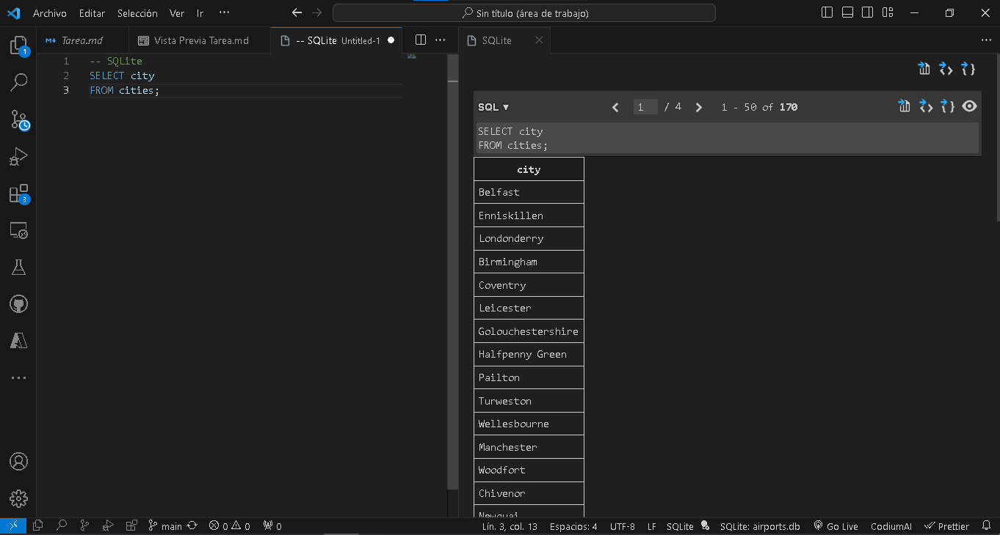

# Displaying airport data

Se le ha proporcionado una [base de datos](https://github.com/microsoft/Data-Science-For-Beginners/blob/main/2-Working-With-Data/05-relational-databases/airports.db) basada en [SQLite](https://sqlite.org/index.html) que contiene información sobre aeropuertos. El esquema se muestra a continuación. Utilizará el método [SQLite extension](https://marketplace.visualstudio.com/items?itemName=alexcvzz.vscode-sqlite&WT.mc_id=academic-77958-bethanycheum) en [Visual Studio Code](https://code.visualstudio.com?WT.mc_id=academic-77958-bethanycheum) para mostrar información sobre los aeropuertos de diferentes ciudades.

## Instrucciones

Para comenzar con la tarea, deberá realizar un par de pasos. Deberá instalar un poco de herramientas y descargar la base de datos de ejemplo.

### Configura tu sistema

Puede usar Visual Studio Code y la extensión SQLite para interactuar con la base de datos.

1. Vaya a [code.visualstudio.com](https://code.visualstudio.com?WT.mc_id=academic-77958-bethanycheum) y siga las instrucciones para instalar Visual Studio Code
1. Instale la [extension SQLite ](https://marketplace.visualstudio.com/items?itemName=alexcvzz.vscode-sqlite&WT.mc_id=academic-77958-bethanycheum) como se indica en la página de Marketplace

### Descargue y abra la base de datos

A continuación, descargará y abrirá la base de datos.

1. Descargue el archivo [archivo de base de datos de GitHub](https://raw.githubusercontent.com/Microsoft/Data-Science-For-Beginners/main/2-Working-With-Data/05-relational-databases/airports.db) y guárdalo en un directorio
1. Abrir Visual Studio Code
1. Abra la base de datos en la extensión SQLite seleccionando **Ctl-Shift-P** (o **Cmd-Shift-P** en una Mac) y escribiendo `SQLite: Open database`
1. Seleccione **Elegir base de datos del archivo** y abra el archivo **airports.db** que descargó anteriormente
1. Después de abrir la base de datos (no verá una actualización en la pantalla), cree una nueva ventana de consulta seleccionando **Ctl-Shift-P** (o **Cmd-Shift-P** en una Mac) y escribiendo `SQLite: New query`

Una vez abierta, la nueva ventana de consulta se puede utilizar para ejecutar instrucciones SQL en la base de datos. Puede usar el comando **Ctl-Shift-Q** (o **Cmd-Shift-Q** en un Mac) para ejecutar consultas en la base de datos.

> [! NOTA] Para obtener más información sobre la extensión SQLite, puede consultar la [documentación](https://marketplace.visualstudio.com/items?itemName=alexcvzz.vscode-sqlite&WT.mc_id=academic-77958-bethanycheum)

## Esquema de base de datos

El esquema de una base de datos es el diseño y la estructura de la tabla. La base de datos **airports** como dos tablas,`cities`, que contiene una lista de ciudades del Reino Unido e Irlanda, y `airports`, que contiene la lista de todos los aeropuertos. Debido a que algunas ciudades pueden tener varios aeropuertos, se crearon dos tablas para almacenar la información. En este ejercicio, utilizará uniones para mostrar información de diferentes ciudades.

| Cities           |
| ---------------- |
| id (PK, integer) |
| city (text)      |
| country (text)   |

| Airports                         |
| -------------------------------- |
| id (PK, integer)                 |
| name (text)                      |
| code (text)                      |
| city_id (FK to id in **Cities**) |

## Asignación

Cree consultas para devolver la siguiente información:

1. Todos los nombres de ciudades en la tabla `Cities`

2. todas las ciudades de Irlanda en la tabla `Cities`

3. Todos los nombres de aeropuertos con su ciudad y país

4. todos los aeropuertos de Londres, Reino Unido

## Rubric

| Ejemplar | Adecuado | Necesita mejorar |
| --------- | -------- | ----------------- |