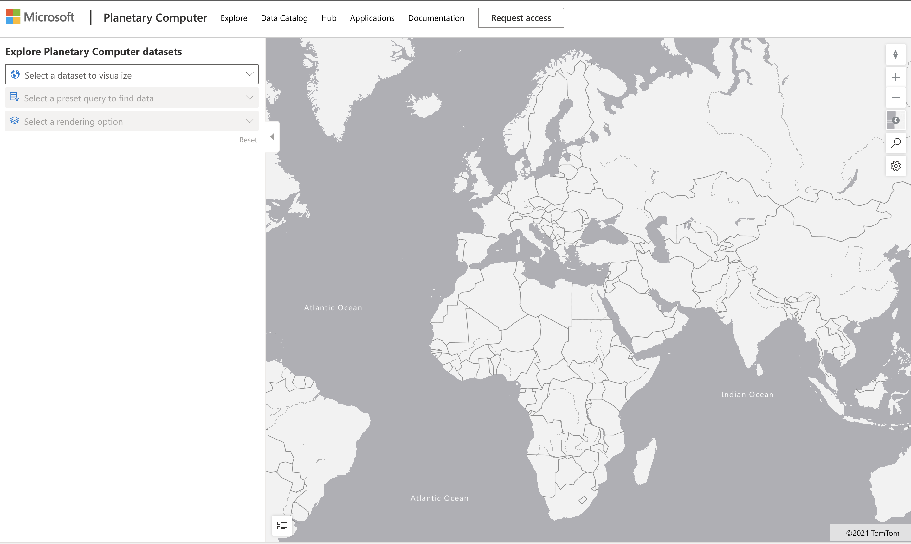

# Explore a Planetary Computer Dataset

## Instructions

En esta lección, hablamos sobre varios dominios de aplicación de la ciencia de datos, con profundizaciones en ejemplos relacionados con la investigación, la sostenibilidad y las humanidades digitales. En esta tarea, explorará uno de estos ejemplos con más detalle y aplicará algunos de sus conocimientos sobre visualizaciones y análisis de datos para obtener conocimientos sobre los datos de sostenibilidad.

El proyecto [Planetary Computer](https://planetarycomputer.microsoft.com/) tiene conjuntos de datos y API a los que se puede acceder con una cuenta; solicite una para acceder si desea probar el paso adicional de la tarea. El sitio también proporciona una función [Explorer](https://planetarycomputer.microsoft.com/explore) que puede utilizar sin crear una cuenta.

`Steps:`
La interfaz del Explorador (que se muestra en la captura de pantalla a continuación) le permite seleccionar un conjunto de datos (entre las opciones proporcionadas), una consulta preestablecida (para filtrar datos) y una opción de representación (para crear una visualización relevante). En esta tarea, su tarea es:

 1. Lea la [documentación de Explorer](https://planetarycomputer.microsoft.com/docs/overview/explorer/): comprenda las opciones.
 2. Explore el [catálogo](https://planetarycomputer.microsoft.com/catalog) de conjuntos de datos : conozca el propósito de cada uno.
 3.Utilice el Explorador: elija un conjunto de datos de interés, seleccione una consulta y una opción de representación relevantes.

!

`Your Task:`
Ahora estudie la visualización que se representa en el navegador y responda lo siguiente:

* ¿ Qué características tiene el conjunto de datos?
* ¿Qué conocimientos o resultados proporciona la visualización?
* ¿ Cuáles son las implicaciones de esos conocimientos para los objetivos de sostenibilidad del proyecto?
* ¿Cuáles son las limitaciones de la visualización (es decir, qué información no obtuvo?)
* Si pudiera obtener los datos sin procesar, ¿qué visualizaciones alternativas crearía y por qué?

`Bonus Points:`
Solicite una cuenta e inicie sesión cuando sea aceptada.

* Utilice la opción Launch Hub para abrir los datos sin procesar en un Notebook.
* Explore los datos de forma interactiva e implemente las visualizaciones alternativas que pensó.
* Ahora analice sus visualizaciones personalizadas: ¿pudo obtener los conocimientos que se perdió antes?

## Rúbrica

Exemplary | Adequate | Needs Improvement
--- | --- | -- |
Se respondieron las cinco preguntas centrales. El estudiante identificó claramente cómo las visualizaciones actuales y alternativas podrían proporcionar información sobre los objetivos o resultados de sostenibilidad.| El estudiante respondió al menos las 3 preguntas principales con gran detalle, demostrando que tenía experiencia práctica con el Explorer. | El estudiante no respondió varias preguntas o proporcionó detalles insuficientes, lo que indica que no se hizo ningún intento significativo para el proyecto. |